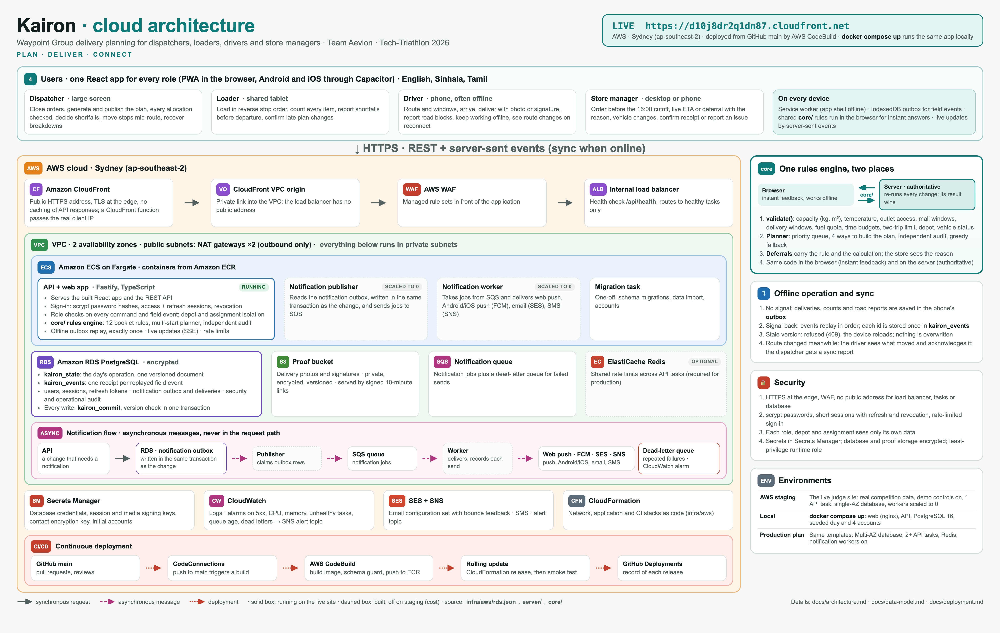

# Kairon

Kairon is a delivery planning system for **Waypoint Group**, a fictional Sri Lankan retailer with 120 outlets in three
brands (Fresh, Style, Tech), two depots (Peliyagoda, Kandy) and 60 vehicles. It was built by team **Aevion** for
Tech-Triathlon 2026.

## Live AWS deployment

**[Open the AWS judge site](https://d10j8dr2q1dn87.cloudfront.net)** — hosted in Sydney with CloudFront, ECS Fargate, RDS PostgreSQL and private S3 storage. AWS is the hosted deployment used for recording and judging.

Kairon turns the day's orders into a plan that obeys the operating rules, and keeps four people in step while the day
goes wrong:

| Role | Device | What they do in Kairon |
|---|---|---|
| **Dispatcher** | Large screen | Closes orders at the cutoff, reviews the generated plan, allocates or defers orders, decides shortfalls, moves stops mid-route, handles breakdowns |
| **Loader** | Shared tablet | Loads each trip in reverse stop order, flags shortfalls before departure, confirms late plan changes |
| **Driver** | Personal phone, often offline | Follows the route, records arrivals and deliveries, reports road problems, syncs and acknowledges route changes on reconnect |
| **Store manager** | Desktop or phone | Places orders before the cutoff, sees the delivery ETA or the deferral and its reason, confirms receipt or reports an issue |

Every action by one role reaches the next through a live stream (server-sent events). Field actions are queued on the
device when offline and replayed in order on reconnect.

For AWS staging, security prerequisites, notification delivery work and the paths to the cloud blueprint, see
[the deployment guide](docs/deployment.md). The RDS template includes private PostgreSQL identities/state, private S3 proof storage, ECS notification workers, Redis and production security controls. Live provider checks and account configuration are required before production.

## For judges

### Deployed site (AWS)

**<https://d10j8dr2q1dn87.cloudfront.net>**, hosted on AWS in Sydney (CloudFront, ECS Fargate, RDS PostgreSQL, S3),
seeded with one delivery day built from the competition datasets. These public judge/demo accounts were verified on AWS on 4 October 2026. Every account listed below uses **`kairon2026`**; this table describes AWS sign-ins.

| Role | Email | Password | Depot / assignment |
|---|---|---|---|
| Dispatcher | `dispatcher@kairon.demo` | `kairon2026` | Geemal, Peliyagoda |
| Loader — Peliyagoda | `loader@kairon.demo` | `kairon2026` | Kamal, Peliyagoda loading bay |
| Loader — Kandy | `loader.kandy@kairon.demo` | `kairon2026` | Kandy loading bay |
| Driver | `driver@kairon.demo` | `kairon2026` | Nimal, Peliyagoda, reefer truck VEH002 (trip TRP-002-1) |
| Store manager — walkthrough | `store@kairon.demo` | `kairon2026` | Dilini, Peliyagoda, Fresh Borella (OUT005) |
| Store manager — Fresh | `fresh@kairon.demo` | `kairon2026` | Peliyagoda, Fresh Borella (OUT005) |
| Store manager — Style | `style@kairon.demo` | `kairon2026` | Peliyagoda, OUT001 |
| Store manager — Tech | `tech@kairon.demo` | `kairon2026` | Peliyagoda, OUT006 |

The three brand-specific store-manager accounts use `@kairon.demo` emails on AWS too. Each manager sees only their assigned outlet. Both loaders see the loading work for their own depot.

1. Sign in as the dispatcher first and use **Demo → Reset demo data**, so the walkthrough starts from a clean day.
2. Then follow the [judge walkthrough](#judge-walkthrough), with one browser window per role (each window keeps its
   own sign-in). Use phone-sized windows for the loader and driver.

The **Demo** pill moves the operation clock and resets the day; on the hosted site only the dispatcher sees its
operation controls, and every role can simulate going offline. All judges share one operation, so a reset also
resets what other judges see. The architecture of the live site is in
[`docs/architecture.md`](docs/architecture.md).

### Run it in one command

Needs only Docker.

```sh
docker compose up
```

Open <http://localhost:8080> and sign in with one of the demo accounts (the sign-in page also has one-tap buttons).
Each `up` builds the current web app and API from your checkout, using cached layers when unchanged.
No `.env`, Supabase project or AWS credentials are needed. For background operation, use `docker compose up -d`;
stop with `docker compose down`. Each API startup reseeds the demo day, replacing previous demo progress
even when the PostgreSQL volume already exists. To keep progress instead, set `SEED_DEMO_EVERY_START: "false"`
in `docker-compose.yml`. To reseed an already-running stack, use `docker compose restart backend`.
Every local demo account uses the password **`kairon2026`**. The hosted sign-ins (`dispatcher@`, `loader@`, `driver@`, `store@` and `loader.kandy@kairon.example`, Kandy depot) also work locally with the same profiles and password.

| Role | Email | Password | Who / assignment |
|---|---|---|---|
| Dispatcher | `dispatcher@kairon.demo` | `kairon2026` | Geemal, Peliyagoda |
| Loader — Peliyagoda | `loader@kairon.demo` | `kairon2026` | Kamal, Peliyagoda |
| Loader — Kandy | `loader.kandy@kairon.example` | `kairon2026` | Kandy loading bay |
| Driver | `driver@kairon.demo` | `kairon2026` | Nimal, drives reefer truck VEH002 |
| Store manager — walkthrough | `store@kairon.demo` | `kairon2026` | Dilini, Fresh Borella (OUT005) |
| Store manager — Fresh | `fresh@kairon.demo` | `kairon2026` | Fresh walkthrough outlet |
| Store manager — Style | `style@kairon.demo` | `kairon2026` | First Style outlet in the loaded dataset |
| Store manager — Tech | `tech@kairon.demo` | `kairon2026` | First Tech outlet in the loaded dataset |

Store-type demo logins are also available: **`fresh@kairon.demo`**, **`style@kairon.demo`**, and **`tech@kairon.demo`**, all with **`kairon2026`**. Fresh uses the walkthrough outlet when available; Style and Tech use the first outlet of their brand in the loaded dataset. Each manager sees only their assigned outlet. The local sign-in page includes buttons for these accounts. Run `docker compose up` to rebuild and enable them.

The stack has three containers: **frontend** (nginx serving the web app on port 8080 and forwarding `/api`), **backend** (the API) and **database** (PostgreSQL 16). The first start creates the
schema, and every API startup seeds one realistic delivery day: the network, fleet and calendar from the competition CSVs when they are in
`data/`, otherwise placeholders, and about 150 orders. The clock starts at 15:20 on the ordering day, 40 minutes before
the cutoff. Then follow the [judge walkthrough](#judge-walkthrough). The **Demo** pill at the bottom left (presenter
only) moves the clock, simulates offline and resets the day.

`GET http://localhost:8080/api/health` reports which data files were loaded (`dataSources`). To start again from a
clean database: `docker compose down -v && docker compose up`. To check the whole story automatically:
`npm --prefix server ci && npm --prefix server run test:walkthrough`.

> Dataset note: the competition datasets are confidential and are **not** in this repository. Without them the demo
> day runs on built-in placeholder data. Placeholder figures are invented, except the examples quoted in the challenge
> booklet.

## Tech stack

### GitHub container packages

The **Publish container packages** workflow publishes Docker images to GitHub Packages after successful
CI on `main`, when a release is published, or when started manually in Actions:

| Image | Purpose |
|---|---|
| `ghcr.io/geemalfernando/kairon` | Production API and web app; requires hosted database and security configuration |
| `ghcr.io/geemalfernando/kairon-demo-api` | Local demo API |
| `ghcr.io/geemalfernando/kairon-demo-web` | Local demo web app |

Images have `sha-<full commit>` tags; verified main builds also have `latest`, and releases get their version tag.
The workflow uses GitHub's built-in token with `packages: write`; no extra publishing secret is needed.
Packages are private initially. For private downloads, sign in with a classic personal access token with
`read:packages` using `docker login ghcr.io -u YOUR_GITHUB_USERNAME` and enter the token at the password prompt.
Public access can be enabled in each package's settings if desired.

Once the packages are published, run the demo without building locally:

```sh
docker compose -f docker-compose.packages.yml up
```

Open <http://localhost:8080>. It uses the same demo accounts and startup reseeding as the source-built stack.
Choose a specific published revision by setting `KAIRON_IMAGE_TAG=sha-<full commit>` before the command.
Both Compose files use the same local project and database volume; stop the running stack before switching.
AWS continues to pull production images from ECR through its existing deployment workflow.

### Application technologies

| Layer | Technology |
|---|---|
| Shared domain logic | TypeScript in `core/`, imported by both the web app and the server (`@core/*`) |
| Web | React 19, TypeScript, Vite, Tailwind CSS v4, Zustand, React Router, i18next (English, Sinhala, Tamil), Leaflet; Capacitor for the Android and iOS apps |
| Offline | vite-plugin-pwa (Workbox service worker), IndexedDB outbox, conflict detection in `web/src/store/conflict.ts` |
| Server | Fastify 5, TypeScript run with tsx, server-sent events at `GET /api/stream` |
| Storage | AWS RDS PostgreSQL + private S3 on the live site; local PostgreSQL for Docker |
| Auth | RDS administrator-managed identities with salted scrypt passwords, JWTs and rotating/revocable refresh sessions; legacy Supabase Auth; demo accounts locally |
| Deploy | AWS: CloudFront, WAF, ECS Fargate, RDS, S3, SQS, Secrets Manager, CloudWatch, as CloudFormation in `infra/aws/` ([guide](docs/deployment.md)); continuous deployment from `main` through AWS CodeBuild; Docker Compose locally |

## Select the backend

The server picks its storage and sign-in with `BACKEND` (or, without it, from whether `SUPABASE_URL` is set).

| | AWS (live site) | Local (`docker compose up`) | Supabase adapter (migration support) |
|---|---|---|---|
| Selected by | `BACKEND=rds` | No `SUPABASE_URL`; `DATABASE_URL` set | `SUPABASE_URL` set |
| Storage | RDS PostgreSQL + S3 proof bucket (`db-rds.ts`) | Local PostgreSQL (`db-postgres.ts`) | Supabase PostgreSQL (`db-supabase.ts`) |
| Sign-in | RDS accounts, scrypt hashes, revocable sessions (`auth-rds.ts`) | The `…@kairon.demo` accounts (`auth-local.ts`) | Supabase Auth |
| Starting data | The demo day from the competition CSVs, imported once | One seeded delivery day on every start | Imported with `import:data` |
| Demo tools | On for the judge site | On | Off |

All three keep the same versioned state and the same `kairon_commit`, so the server code above the storage layer is
identical. Keep `DEMO_MODE` and `SEED_DEMO_DAY` off for real use.

## Repository structure

```
core/         Shared rules and logic (single source of truth)
  src/rules.ts     Validation, trip time, planner, priority, deferral explanations
  src/ops.ts       Operation state, commands, field events (applyEvent)
  src/adapter.ts   CSV rows to app model, mall window narrowing
  src/csv.ts       CSV row types and header validation
  src/catalog.ts   Product catalogue, order cutoff, chilled/dry split
  src/demo.ts      The demo delivery day and demo accounts (used only with the demo flags and by tests)
  src/reference.ts, predict.ts, time.ts, types.ts
server/       Fastify API
  src/app.ts       All endpoints
  src/operation.ts The authoritative operation: commands, field events, persistence
  src/db.ts        Storage switch: db-rds.ts (AWS), db-supabase.ts (legacy) or db-postgres.ts (demo)
  src/auth.ts      Sign-in switch: auth-rds.ts (AWS), legacy Supabase Auth or auth-local.ts (demo)
  test/            Unit tests, Supabase flow test, smoke and walkthrough tests
  scripts/         seed-users, import-data, planner calibration
infra/aws/    CloudFormation: network, application stack (rds.json), CodeBuild deployment
database/     SQL migrations for AWS RDS
supabase/     SQL migrations for the legacy Supabase database
web/          React app: pages per role in src/pages/, demo states in src/demo/; android/ and ios/ (Capacitor)
data/         Put the competition CSVs and catalog.json here (git-ignored)
docs/         Architecture (poster and diagrams), data model, AWS deployment guide, AI disclosure
Dockerfile, docker-compose.yml, .env.example, .github/workflows/ci.yml
```

## Hosted deployment and local development

Use [the AWS deployment guide](docs/deployment.md) for RDS identity provisioning, private storage, image releases and AWS CodeBuild deployment. For local development, use the Docker stack described above or start the API and Vite separately against your local PostgreSQL database. The browser uses the authenticated API for every operation and queues field events while offline.

## Datasets

Copy the competition CSVs into `data/` (`import:data` reads them from `data/` itself; the demo seed also finds them in
sub-folders such as `General Data/`):

| File | Used for |
|---|---|
| `outlets.csv` | Outlets, brand, district, depot, `dock_type`, `parking_constraint`, `mall_window`, delivery windows |
| `vehicles.csv` | Fleet: type, temperature, capacities, fuel profile, home depot |
| `calendar.csv` | Operating days (`is_operating`), paydays, festivals |
| `district_travel.csv` | `depot_to_district_freeflow_min` and `inter_stop_freeflow_min` for trip time |
| `service_allowance.csv` | Handling allowance per brand and dock type |
| `fleet_status.csv` | `vehicle_id,status` (`available` or `in_workshop`) |

In local demo mode, the server loads what is present on the first start (or **Demo, Reset**) and falls back to
placeholders for anything missing. The competition download has no `fleet_status.csv`; with real vehicles and no fleet
file, every vehicle is available. `traffic_speed.csv` and `road_conditions.csv` are not used.

**Never commit the CSVs.** The competition terms forbid sharing the datasets, and `data/**/*.csv` is in `.gitignore`.
`docker compose` mounts `data/` into the backend read-only at start; the CSVs are never copied into an image.

## Architecture and data model



- [`docs/architecture.md`](docs/architecture.md): the poster above, components, the AWS and local deployments, how one
  delivery moves through the system (including an offline driver), how every write is committed, the planner,
  security and notifications.
- [`docs/data-model.md`](docs/data-model.md): the domain model (outlets, vehicles, orders, trips and what happens to
  them), how each competition CSV maps onto it, the storage tables, and why the operation is stored as one versioned
  snapshot, plus the account, session and notification tables on AWS.
- [`docs/deployment.md`](docs/deployment.md): how the AWS stack is deployed and released, and
  [`docs/architecture/kairon-aws-deployment.png`](docs/architecture/kairon-aws-deployment.png), the deployment as built.

The diagrams are Mermaid, so GitHub draws them in place; PNG copies are in [`docs/diagrams/`](docs/diagrams/).

In short: the whole operation for the day is one versioned JSON document in `kairon_state`. Every command or field
event is checked by the shared rules in `core/` and committed with `kairon_commit` in one transaction, together with
the ids of replayed offline events (`kairon_events`, so an outbox is applied once) and proof photos (`kairon_media`).
A write against an old version is refused, so devices and serverless instances never overwrite each other.

## Checks and tests

```sh
cd server
npm test                  # 101 unit tests: rules, planner, Supabase flow (in-memory repository, no database)
npm run typecheck         # tsc, includes core/ and the tests
npm run test:walkthrough  # full 4-role story against a local demo stack (docker compose up); resets the demo
npm run test:smoke        # read-only check of a deployed API with the SEED_* accounts from .env

cd ../web
npm run lint              # oxlint
npm run build             # type-checks the web app and shared core, then builds
```

`server/test/rules.test.ts` covers the booklet trip-time examples (101, 112 and 213 minutes, a third trip rejected) and
a pass and a fail case for each of the 12 hard constraints below. `server/test/planner.test.ts` covers the planner:
the objective order, determinism, never worse than the original greedy plan, the audit (on the demo day, on 24 seeded
random smaller worlds, and on deliberately broken plans), the greedy fallback, locked stops and locked trips, the
recovery reserve and the deferral wording. `server/test/supabase-flow.test.ts` covers the operation against an
in-memory repository: version checks, offline replay and proof media. Unit tests never create records in Supabase. The
web app has no unit tests.

CI (`.github/workflows/ci.yml`) runs the API tests and typecheck, web lint and build, the Docker
stack with the 4-role walkthrough, the Android and iOS builds, and a production smoke test.

## Judge walkthrough

This follows one delivery day across all four roles. It works on the deployed site (accounts `…@kairon.example`)
and on `docker compose up` (accounts `…@kairon.demo`); the steps below name the local accounts. Use one browser window
per role (each window keeps its own sign-in, so roles can sit side by side), and phone-sized windows for the loader
and driver. **Demo** is the pill at the bottom left of the app; it is presenter-only. Start with **Demo → Reset demo
data** as the dispatcher.

The team clicked through these steps end to end on the competition data while recording the demo video. Order IDs
other than the story's can differ from day to day.

**Ordering day**

1. **Store manager** (`store@kairon.demo`): open `/store/orders/new` and place an order for OUT005 before the 16:00
   cutoff. Chilled and dry goods are split into two deliveries. The order enters planning at the cutoff.
2. **Dispatcher** (`dispatcher@kairon.demo`): open `/dispatcher/orders` and use Demo, **Close orders & generate plan**.
   Confirmed orders enter one queue, ordered by priority, then earliest window close. On the planning page
   (`/dispatcher/planning`) read the draft plan: served and deferred counts, the binding resource (on the demo day,
   usually reefer capacity), and the recovery-reserve trade-off (VEH007 and VEH036 held back). A green line above it
   confirms that every allocation passes every operating rule, re-checked independently of the planner and including
   any change you make by hand.
3. **A rule blocks an allocation.** Drag a chilled order onto a dry truck. Every rule is checked, there is no override,
   and vehicles that fit are suggested. Shortcut: `/dispatcher/planning?modal=blocked&demo=blocked`.
4. **A deferral.** Open `/dispatcher/deferred` to review each deferral with its constraint, calculation and next run.
   Then defer one order by hand from its drawer (choose a reason; `dispatcher_choice` needs a note) and check the store
   manager's `/store` shows the notice with the reason and the new date. To keep the story below intact, defer
   Borella's dry-goods order, which travels on another truck, not its chilled order on TRP-002-1. Shortcut showing the
   store's view: `/store?demo=store-deferred`.
5. **Dispatcher**: Demo, **Publish plan to loaders & drivers**. Loader, driver and store are notified.

**Loading (phone-sized, loader)**

6. **Loader** (`loader@kairon.demo`): open `/loader/trips`, then `/loader/load/TRP-002-1`. Load in reverse stop order
   (last stop goes in first) and count each item.
7. **Shortfall before departure.** Flag missing dairy on OUT005 (for example 3 crates damaged). The dispatcher decides
   at `/dispatcher/issues`; the decision appears on the loader's stop and on the store's dashboard. Shortcuts:
   `/loader/load/TRP-002-1?modal=shortfall&demo=shortfall`, `/dispatcher/issues/shortfall?demo=shortfall-reported`.
8. **Plan changed after loading started** (second degradation scenario). Dispatcher: Demo, **Change VEH002's plan
   during loading**. The loader gets a checklist for the change, and the driver cannot depart until the loader confirms
   the new load. Shortcuts: `?demo=plan-changed`, `?demo=change-pending`.
9. **Loader**: complete loading of TRP-002-1.

**On the road (phone-sized, driver, offline)**

10. **Driver** (`driver@kairon.demo`, VEH002): set the clock with Demo, **04:40 departure**, open `/driver`, start the
    route, then arrive at and deliver the first stop (**I've arrived**, **Confirm items**, a proof photo or signature,
    **Deliver**).
11. **Road blocked, then signal lost** (the hero degradation scenario). While still online, the driver opens **Issues**,
    **Report vehicle issue**, chooses **Road blocked**, picks **OUT005** (Fresh Borella) as the stop that will be late,
    a delay such as 90 min, and taps **Tell the dispatcher**. Then, in the driver's window, Demo, **Simulate offline**.
    The app shows "You're offline" with a pending count; the driver keeps delivering, and each action is saved on the
    phone and listed at `/driver/sync`. Shortcut: `/driver/route?demo=offline`.
12. **Dispatcher**: the road report appears in **Issues** and on `/dispatcher/routes/TRP-002-1`. A quiet driver is
    still assumed on plan; a stop moves only on the driver's own report. The move-stop dialog compares staying with
    moving, including fuel. Use Demo, **Move a VEH002 stop to the reserve van**: it moves the reported stop (Borella) to
    VEH036 as trip TRP-036-M1. Shortcut: `/dispatcher/routes/TRP-002-1?modal=move-stop&demo=move-stop`.
13. **Reconnect.** Turn Simulate offline off. The queued events replay in order. On `/driver/reconcile` the route
    change cannot be missed: it shows what was kept, what moved and what to do now, and the driver acknowledges it.
    Dispatcher `/dispatcher/live` shows the sync report and that the driver saw the change. Shortcuts:
    `/driver/reconcile?demo=conflict`, `/dispatcher/live?demo=synced`.
14. **Edge case.** If the driver delivered the moved stop offline before the change reached them, the offline record
    wins and the reserve van's re-pick is cancelled. Shortcut: `/driver/reconcile?demo=conflict-collided`.
15. **Breakdown recovery** (third scenario). A reefer failing before 08:00 with chilled goods is rescued using the
    reserve reefer. Shortcuts: `/dispatcher/issues/breakdown?demo=breakdown`, `/driver?demo=recovered`.

**Delivery and receipt**

16. **Store manager** (`store@kairon.demo`): `/store` puts the delivery with something happening first. After step 12
    it shows Borella's chilled order on **VEH036**, with "Delivery vehicle changed: now VEH036 instead of VEH002", the
    reason, and the van's arrival time. (Between the road report and the move, it shows the driver's reported delay.)
17. **The reserve van delivers.** The van has no demo driver account, so the dispatcher uses Demo, **VEH036 delivers
    the moved stop**. It drives the van's trip with the same field events a phone sends, and moves the clock to the
    delivery time.
18. **Receipt.** On `/store` the card now shows **Delivery arrived**: enter the units received, the condition and the
    receiver, then **Confirm receipt**; the order becomes Received. Or use **Something wrong? Report an issue**
    (missing, damaged or wrong goods, with a photo), which reaches the dispatcher's **Issues**. Shortcuts:
    `/store?demo=store-delivered`, `/store?modal=report-issue&demo=store-issue`.
19. **The record.** Dispatcher, **History & audit**: search the order to see its whole day, from the order to the
    move and the confirmed receipt.
20. **The next day** (optional). When every trip is completed, the planning page shows **Close day & plan next**. It
    records the day's fuel against each vehicle's weekly quota (see `/dispatcher/vehicles`), carries deferred orders
    to the next run with a higher priority, and opens the next operating day for ordering. To finish trips quickly
    in the demo, use Demo, **Send the rest of the fleet out**.

The `?demo=<id>` links open a sandboxed copy of the operation in a named state; nothing is saved or synced. The full
list of states is in `web/src/demo/presets.ts`. Other URL switches: `frame=1` hides presenter chrome, `theme=dark|light`,
`lang=en|si|ta`, `day=YYYY-MM-DD` pins the ordering day. A preset link signs in the role that matches its path, so no
sign-in is needed first.

Other useful screens: `/dispatcher/capacity` (demand forecast), `/dispatcher/simulator`, `/states` (index of screen
states). The `?demo=` links, `/states` and the Demo pill exist only in a demo build (`VITE_DEMO_MODE=true`, used by
`docker compose` and the judges' deployed site); a production build has none of them.

## Booklet rules enforced

These are hard constraints from the challenge booklet. Every allocation, automatic or manual, goes through
`validate()` in `core/src/rules.ts` and a blocked allocation cannot be overridden. The check names below are the
`key` of each check in the validator result.

| # | Rule | Check |
|---|---|---|
| 1 | All orders on a trip share brand and district. Checked against every stop of every trip on the vehicle, so a hand-built mixed trip is rejected | `trip` |
| 2 | `chilled` needs a reefer; a reefer may carry ambient; ambient never carries chilled | `temperature` |
| 3 | `van_only` outlets need a van | `access` |
| 4 | A vehicle serves only its own depot's outlets | `depot` |
| 5 | Whole orders: one order, one vehicle, one trip, never split | Planner and `validate()` allocate whole orders only |
| 6 | Trip weight within `weight_cap_kg` and trip volume within `volume_cap_m3` | `weight`, `volume` |
| 7 | At most 2 trips per vehicle per day, all brands combined | `trips` |
| 8 | Fresh trips together within 270 min (03:30 to 08:00); Style and Tech trips together within 480 min. Separate budgets, shared 2-trip limit | `budget` |
| 9 | Each outlet's own delivery window governs arrival; an early vehicle waits for it to open | `window` |
| 10 | `mall_dock` outlets accept deliveries only inside `mall_window` | `mall` |
| 11 | A vehicle's route distance is charged against `weekly_fuel_quota_l` (distance model is a team policy, below) | `fuel` |
| 12 | Vehicles in the workshop or otherwise unavailable cannot be allocated | `status` |

Also enforced: every stop id on a vehicle's trips must resolve to a known order and outlet (`orders`). Orders are keyed
by order id, not outlet id, because a Fresh outlet can have a dry and a chilled order on the same day.

**Trip time** (booklet formula, no return leg):

```
trip_minutes = depot_to_district_freeflow_min
             + inter_stop_freeflow_min x (stops - 1)
             + sum of service_allowance_min(brand, dock_type)
```

Worked examples, kept as passing unit tests: Gampaha Fresh with 3 stops (rear_dock, rear_dock, street) is
37 + 18 + 15 + 15 + 16 = **101** min; Colombo Fresh with 4 street stops is 24 + 24 + 64 = **112** min; the same
vehicle running both is 101 + 112 = **213** min, within 270, and a third trip is rejected.

The rest of the booklet setup (Mon to Sat operation from `calendar.csv`, 4 PM cutoff for next-day delivery, all times
in Asia/Colombo) is applied in `core/src/time.ts`, `core/src/catalog.ts` and the seed in `core/src/ops.ts`.

## Assumptions and team policies

These are Aevion's own design decisions, not booklet rules. Each is a deliberate choice where the booklet is silent.
The constants live in `core/src/rules.ts` unless noted.

**Fuel model.** The booklet gives a weekly quota but no distance model. We assume
`trip_km = 2 x depot_to_district_km + inter_stop_km x (stops - 1)` and `litres = trip_km / km_per_l`. An allocation is
blocked when the fuel already used this week plus today's litres exceed `weekly_fuel_quota_l`. Fuel already used is
seeded deterministically on the demo day (fixed seed 29, 25 to 60 percent of the quota) so a fresh install behaves the
same every time. VEH024 is fixed at 93 percent of its quota as the intentional fuel demo case, and VEH002 (the story
vehicle) at 40 L (`enrichForDemo` in `core/src/demo.ts`).
The quota builds up through the week: **Close day & plan next** on the planning page (`startNextDay`) adds the fuel
of the day's completed trips to each vehicle's fuel used this week, and the first operating day of a new ISO week
starts every vehicle at 0. Closing the day is refused while a published trip hasn't finished. It also updates
each outlet's service history (days since the last delivery, skipped on the previous run, which raises its priority)
and puts deferred orders in the next run's queue.

**Priority score** (`priorityOf`). Fresh chilled +60, Fresh dry +50, Tech +40, Style +30; skipped on the previous run
+35; +20 for each run already deferred; +4 per day since the last delivery (up to 4 days); capped at 99. The queue is
ordered by priority first, so the promise holds whatever else the planner tries: an outlet skipped yesterday goes
first today and is flagged if skipped again. Every component is shown to the dispatcher as a reason.

**Planner objective and multi-start** (`generatePlan`, `comparePlans`). Plans are compared lexicographically: no
rule violations, then the least total priority deferred, then the most orders served, then the fewest trips, then the
fewest km. Within each priority band, the order in which equal-priority orders are tried decides how many fit, so the
plan is built four ways (`PLAN_STARTS`): earliest window close (the original planner), scarcest orders first,
short-haul districts first, and largest district groups first; all but the first keep each brand and district group
together. The best plan by the objective is kept. Every candidate is re-checked by `auditPlan`, and if the best one
fails, the original greedy plan is used instead.

**Locked stops** (`order.lock`, `lockStop` / `unlockStop`). A dispatcher can lock a stop to a vehicle. Re-planning then
keeps it on that vehicle at the same arrival time, and other orders may only use the vehicle's remaining capacity and
time where they don't change a locked stop's arrival (the `locked` check in `validate`). A dispatcher can also lock a
whole trip (`lockTrip` / `unlockTrip`): its stops are locked as one closed trip, and no other order may join it.
Moving a locked stop by hand needs an unlock first; unassigning, deferring, moving it mid-route or a breakdown recovery
clears the lock. The demo story trip on VEH002 is seeded as a locked trip, which replaces the old rule that reserved
the story vehicle for the story.

**Vehicle choice** (`fitScore`, lower is better). Joining an existing trip scores 0; a new trip scores 10 if the vehicle
already has one, otherwise 20; a reefer used for ambient goods +30; a van used where a truck could go +25; a reserve
vehicle +100; fuller vehicles are slightly preferred. This saves scarce reefers and vans for the orders that need them.

**Recovery reserve.** Two reefers, **VEH007 and VEH036**, are held back from planning unless the dispatcher releases
them (`RECOVERY_RESERVE` in `core/src/demo.ts`; the planner honours any vehicle with `reserve` set), so a breakdown before 08:00 can be rescued. Holding them costs
served orders. Deferrals it causes are labelled as a dispatcher and policy choice, never as unavoidable capacity
shortage. The figure depends on the day; on the real CSVs for the 28 September demo day it is 7 orders (see
departures below). The planning page computes it live for the day being planned.
For the Datathon, a deferral caused by the reserve is a chosen deferral and must be justified in the written policy.

**Operational times.**

| Constant | Value | Meaning |
|---|---|---|
| `RELOAD_MIN` | 20 min | Return, unload and reload between a vehicle's two trips |
| `REPICK_MIN` | 25 min | Re-pick at the depot before a moved stop leaves on another vehicle |
| `TRANSFER_MIN` | 30 min | Rescue vehicle drives out and takes over the load after a breakdown |
| `FRESH_START` | 03:30 | Earliest departure of a Fresh trip |
| `STYLE_TECH_START` | 06:30 | Earliest departure of a Style or Tech trip |

An editable trip leaves just in time to reach its first window, never before the vehicle is back and reloaded.

**Mall windows.** The window a delivery must hit is the outlet's requested window narrowed to its `mall_window`
(`effectiveWindow` in `core/src/adapter.ts`). If the two never overlap, the mall window wins, because mall security
will not admit the vehicle otherwise.

**Arrival-based mall check.** The `mall` check fails a mall delivery if service would start before the mall bay opens
or the vehicle arrives after it closes. An early vehicle waits for the bay to open. It compares the arrival time, not
the time service finishes, so a service that starts inside the window may run past the close. This matches how the
delivery-window check works. It is stricter than the narrowed window only when an outlet's window was never narrowed.

**The 08:00 warning.** The booklet says Fresh must arrive before 08:00, but individual outlets' windows can differ. The
outlet's own window is therefore the hard check, and a Fresh stop that would finish after 08:00 is shown as a visible
warning on the planning page (`Planning.tsx`) and does not block the allocation.

**Code fallbacks.** If `service_allowance.csv` has no row for a brand and dock type, 15 minutes is used; if a district is
missing from `district_travel.csv`, a generic suburban district is used. Both are placeholders to keep the app running,
not figures from the booklet.

**Data.** Without the real CSVs the app uses invented placeholder values, except the booklet examples (Fresh with
rear_dock 15 min, Fresh with street 16 min, Colombo 24 min out and 8 min between stops, Gampaha 37 and 9).

## Departures from the Day 5 design

> **TODO (team):** list every other place where the implementation differs from the Day 5 design: screens not built,
> changed or merged, flows changed, and why. Judges score fidelity to the design, so an honest list is better than an
> empty section. Suggested table columns: Design screen or behaviour | What was built | Why it differs.

### Planner: more orders served on the same fleet

The Day 5 design showed a single greedy pass: orders by priority, then earliest window close. The planner now builds
the plan four ways and keeps the best by the team's objective (no rule violations, then the least total priority
deferred, then the most orders served, then the fewest trips, then the fewest km); see "Planner objective and
multi-start" above. Every candidate is re-checked by an independent audit, and if the best one failed, the original
greedy plan would be used. Priority bands are unchanged, so an outlet skipped yesterday still goes first. Measured on
the 28 September demo day: the network and fleet from the competition CSVs, the orders from the demo seed.

| Metric | Day 5 design (greedy) | Now (multi-start) |
|---|---|---|
| Orders served / deferred | 139 / 14 | 141 / 12 |
| Total priority deferred | 800 | 680 |
| Chilled orders served | 45 / 55 | 47 / 55 |
| Trips (vehicles used) | 66 (38) | 54 (34) |
| Distance | 7,237 km | 6,553 km |
| Planner runtime | about 100 ms | about 270 ms |

The deferral wording also changed: a chilled order blocked by windows or the Fresh time budget now says it is short of
reefer *time* ("No reefer can reach OUT019 before 07:30 …"), not reefer space, because on the demo day reefers are
far from full by volume. The reason codes are unchanged.

### Recovery reserve trade-off: about 11 orders becomes 7

The Day 5 core trade-off page says holding the two reserve reefers costs about 11 orders on the demo day. On the real
CSVs with the multi-start planner the cost is 7 orders. The trade-off itself is unchanged; only the figure moved. The
planning page computes it live for the day being planned.

### Story vehicles and outlets renumbered to match the real data

The Day 5 screens tell the story with reefer VEH014, Dilini's outlet OUT032 (Borella), and reserve vehicles VEH008
and VEH031. Those ids came from our placeholder data. In the competition CSVs they are a dry truck, a Gampaha outlet
and two dry trucks, so the story could not run on the real data. The story now uses ids that have the same roles in
the CSVs:

| Role in the story | Day 5 design | Now |
|---|---|---|
| Nimal's reefer truck, hero trip | VEH014, TRP-014-1 | VEH002, TRP-002-1 |
| Dilini's outlet, Fresh Borella (4th stop, 06:09) | OUT032 | OUT005 |
| The other four Colombo stops | OUT004, OUT018, OUT047, OUT056 | OUT008, OUT010, OUT013, OUT012 |
| Recovery reserve (reefer truck, reefer van) | VEH008, VEH031 | VEH007, VEH036 |
| Skipped yesterday | OUT043 | OUT043 (Fresh, Kalutara) |
| Fuel-quota example | VEH024 | VEH024 |

Names, times and the order of events are unchanged: the trip still leaves at 04:36 and reaches Borella at 06:09. The
placeholder data uses the same ids, so the story is the same with or without the CSVs.

### Locked stops and locked trips (new)

Not in the Day 5 design. A dispatcher can lock a stop to its vehicle, or lock a whole trip (Planning page: the lock
button in an order's drawer, and "Lock trip" on a trip card). Re-planning keeps locked stops on their vehicle at the
same arrival times, and adds nothing to a locked trip; other orders may only use the room around them. Unassigning,
deferring, moving a stop mid-route or a breakdown recovery clears the lock for that stop. The demo story's trip
TRP-002-1 (VEH002, five Colombo stops) is seeded as a locked trip, which replaces an earlier rule that reserved VEH002
for the story and kept its spare capacity out of planning. The hero trip therefore stays exactly the five designed
stops at the designed times.

## Known limitations

- The real CSVs are not in the repository, so a local run without them uses placeholder data.
- Judges on the deployed site share one operation; a reset by one judge resets it for everyone.
- The recovery reserve is set only on the demo day; a real import doesn't mark reserve vehicles yet. A real import
  starts each vehicle's week at 0 L, and fuel then builds up as days are closed.
- Fuel used is the planned distance of completed trips (the booklet's distance model), not a measured odometer or
  fuel-card reading.
- Late-risk and service-time estimates appear only after Datathon model output is loaded (`POST /api/predictions`);
  there are no placeholder predictions, so screens from the Designathon that showed late risk are blank until then.
- Demo outlets are placed near their district centre (approximate); real maps need `latitude`/`longitude` in
  `outlets.csv`.
- The Sinhala and Tamil translations are AI-drafted and need review by native speakers (see `docs/ai-disclosure.md`).
- The web app has no automated tests; `npm run lint` and `npm run build` are its checks.

## AI tool disclosure

See [`docs/ai-disclosure.md`](docs/ai-disclosure.md).
