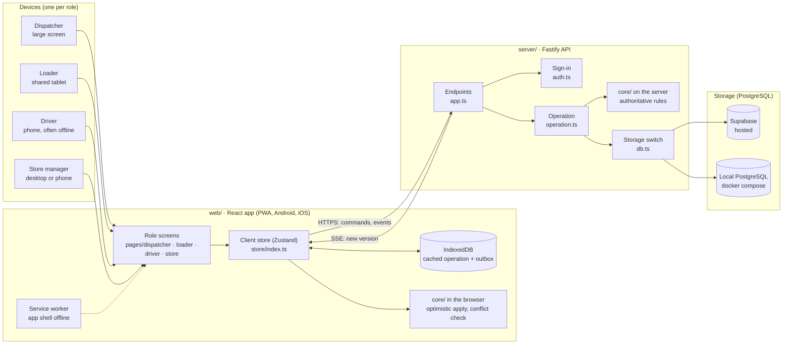
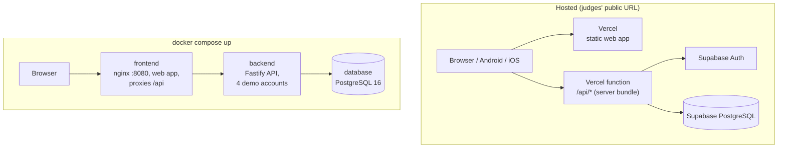
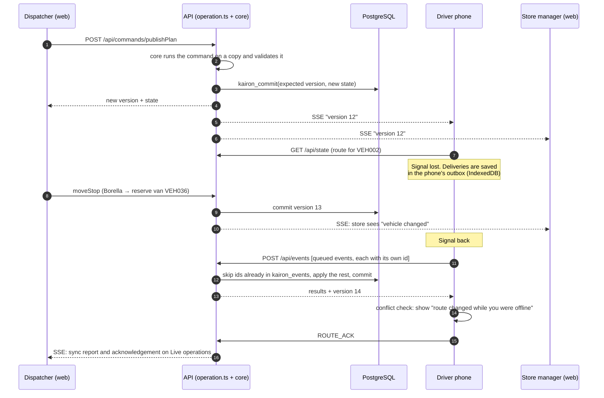
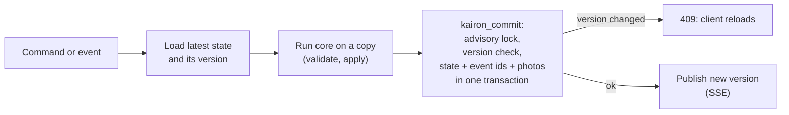
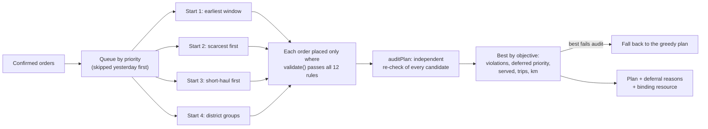

# Kairon architecture

Kairon is one TypeScript codebase in three parts. The planning and operating rules live once, in `core/`, and run in
both the browser and the server. The server holds the one shared operation and is the only place that saves it.

- `core/`: the rules engine, used by both sides. Validation of the 12 booklet constraints, trip time, the planner,
  commands and field events.
- `web/`: the React app for all four roles. It is installable as a PWA, works offline for drivers and loaders, and
  is wrapped as Android and iOS apps with Capacitor.
- `server/`: the Fastify API. It handles sign-in, role checks, commands, the offline outbox replay, live updates and
  storage.

The data model is in [data-model.md](data-model.md). The diagrams below are Mermaid (GitHub draws them); PNG copies
are in [diagrams/](diagrams/).

## 1. Components

| Component | Where | What it does |
|---|---|---|
| Role screens | `web/src/pages/` | One workspace per role. Dispatcher screens are for large displays; loader and driver screens are designed for phones (390 × 844). |
| Client store | `web/src/store/index.ts` | Holds the latest operation from the server, runs commands optimistically through `core/`, and queues field events while offline. |
| Outbox | IndexedDB (Dexie) | Field events (load counts, deliveries, proof photos, road reports) are saved on the device first and sent in order when online. |
| Conflict check | `web/src/store/conflict.ts` | After an offline period, compares the route the driver had with the server's. Moved stops are shown on a screen the driver must acknowledge. |
| Endpoints | `server/src/app.ts` | `/api/auth/*`, `/api/state`, `/api/commands/:name`, `/api/events`, `/api/stream` (SSE), `/api/media/:id`, `/api/predictions`, `/api/export/allocation.csv`, `/api/demo/reset` (demo mode only). |
| Sign-in | `server/src/auth.ts` | Supabase Auth on the hosted site (JWT checked against the project's JWKS); the four demo accounts with HMAC-signed tokens in local mode (`auth-local.ts`). |
| Operation | `server/src/operation.ts` | Checks each user's role and scope (a store manager only sees their outlet, a driver only their vehicle), then runs the command or event. Writes are serialised. |
| Rules engine | `core/src/rules.ts`, `ops.ts` | `validate()` for the 12 hard constraints, trip time, the multi-start planner with `auditPlan`, deferral reasons, and every command and field event. |
| Storage switch | `server/src/db.ts` | Supabase when `SUPABASE_URL` is set (`db-supabase.ts`), otherwise a local PostgreSQL (`db-postgres.ts`). Same tables and commit function. |

## 2. Deployments

| | Hosted | `docker compose up` |
|---|---|---|
| Web app | Vercel static hosting | nginx container (`docker/frontend.conf`) |
| API | One Vercel serverless function (`web/api/index.mjs`, bundled from `server/`) | `backend` container |
| Database | Supabase PostgreSQL | `database` container (PostgreSQL 16, volume `db-data`) |
| Sign-in | Supabase Auth accounts (`seed:users`) | The four `…@kairon.demo` accounts |
| Starting data | The demo day, seeded once with `seed:demo` from the CSVs | The demo day, seeded on first start |
| Live updates | SSE, closed before the function time limit and reopened by the browser; each instance polls the version | SSE |

Several Vercel instances can serve one operation at once. They don't share memory, so every write checks the stored
version (section 4), and every open stream polls for new versions every 3 seconds.

## 3. One delivery, through the system

How a change by one role reaches the others, including a driver who is offline.

**Rules that make this safe:**
- **The server decides.** Devices run the same `core/` code so screens update instantly, but the server re-runs every
  command and event and replaces the device's copy with its result.
- **Events are replayed exactly once.** Each queued event has an id made on the device. The server records each id in
  `kairon_events`, so sending the same outbox twice changes nothing.
- **Real events beat plans.** If a driver delivered a stop offline before learning it had moved, the delivery stands
  and the reserve van's re-pick is cancelled.
- **No silent overwrite.** A write against an old version is refused with 409, and the client reloads.

## 4. Writing the operation

Every write runs in one PostgreSQL transaction (`kairon_commit`, in `supabase/migrations/202610010001_kairon.sql` and
`server/src/db-postgres.ts`). It writes the new state, the replayed event ids and any proof photos together, or none
of them.

## 5. The planner

Locked stops and the locked story trip are placed first and never moved. The recovery reserve (VEH007, VEH036) is
left out unless the dispatcher releases it. Every deferred order carries the rule that stopped it and the calculation
shown to the store manager.

## 6. Security

- **Who may do what is checked on the server.** Each command has a list of allowed roles (`COMMAND_ROLES`), and each
  field event a list of roles that may record it (`EVENT_ROLES`). A store manager can only order for, and confirm, their
  own outlet. A driver can only record events for their own vehicle. A loader can only load their own depot's trips.
- **Database access goes through the API.** On Supabase, row-level security blocks direct browser access, and the
  secret key stays on the server.
- **Demo tools are switched off by configuration.** The operation clock, fleet simulation and demo reset need
  `DEMO_MODE=true` on the server. The demo panel and demo-account buttons are only in a web build made with
  `VITE_DEMO_MODE=true`.
- Proof photos are served by unguessable 128-bit ids.
