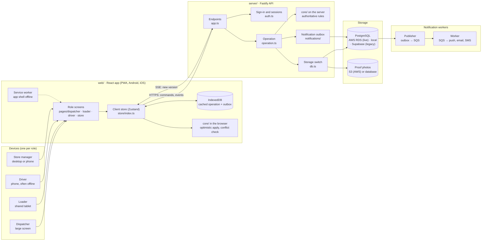
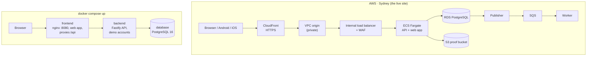
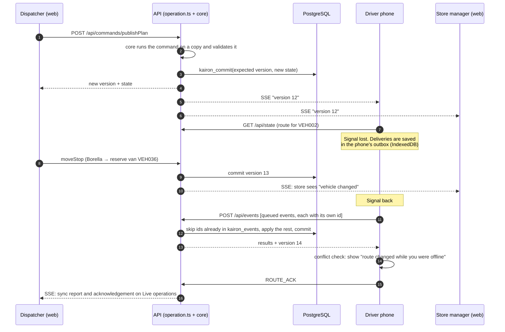
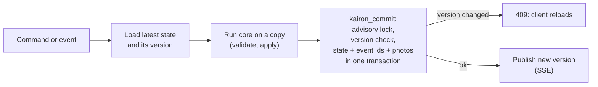
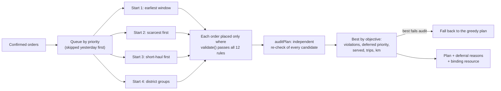
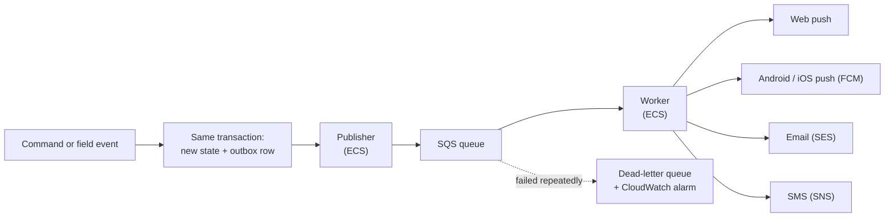

# Kairon architecture

*The overview above shows what runs on AWS for the live site. Its source is
[architecture/kairon-architecture.html](architecture/kairon-architecture.html). The deployment as it was built,
including the CI/CD accounts and the fixes made during the first deploy, is in
[architecture/kairon-aws-deployment.png](architecture/kairon-aws-deployment.png), and the steps are in
[deployment.md](deployment.md).*

Kairon is one TypeScript codebase in three parts. The planning and operating rules live once, in `core/`, and run in
both the browser and the server. The server holds the one shared operation and is the only place that saves it.

- `core/`: the rules engine, used by both sides. Validation of the 12 booklet constraints, trip time, the planner,
  commands and field events.
- `web/`: the React app for all four roles. It is installable as a PWA, works offline for drivers and loaders, and
  is wrapped as Android and iOS apps with Capacitor.
- `server/`: the Fastify API. It handles sign-in, role checks, commands, the offline outbox replay, live updates,
  storage and notifications.
- `infra/aws/`: the AWS deployment as CloudFormation templates (network, application stack, CI/CD).

The data model is in [data-model.md](data-model.md). The diagrams below are Mermaid (GitHub draws them); PNG copies
are in [diagrams/](diagrams/).

## 1. Components

| Component | Where | What it does |
|---|---|---|
| Role screens | `web/src/pages/` | One workspace per role. Dispatcher screens are for large displays; loader and driver screens are designed for phones (390 × 844). |
| Client store | `web/src/store/index.ts` | Holds the latest operation from the server, runs commands optimistically through `core/`, and queues field events while offline. |
| Outbox | IndexedDB (Dexie) | Field events (load counts, deliveries, proof photos, road reports) are saved on the device first and sent in order when online. |
| Conflict check | `web/src/store/conflict.ts` | After an offline period, compares the route the driver had with the server's. Moved stops are shown on a screen the driver must acknowledge. |
| Endpoints | `server/src/app.ts` | `/api/auth/*`, `/api/state`, `/api/commands/:name`, `/api/events`, `/api/stream` (SSE), `/api/media/:id`, `/api/predictions`, `/api/export/allocation.csv`, `/api/demo/reset` (demo mode only). Rate-limited, with a stricter limit on sign-in. |
| Sign-in | `server/src/auth.ts` | AWS: accounts in RDS with scrypt password hashes, short access sessions, refresh tokens and revocation (`auth-rds.ts`). Local: the demo accounts with HMAC-signed tokens (`auth-local.ts`). Legacy: Supabase Auth. |
| Operation | `server/src/operation.ts` | Checks each user's role and scope (depot, a store manager's outlet, a driver's vehicle), then runs the command or event. Writes are serialised. |
| Rules engine | `core/src/rules.ts`, `ops.ts` | `validate()` for the 12 hard constraints, trip time, the multi-start planner with `auditPlan`, deferral reasons, and every command and field event. |
| Storage switch | `server/src/db.ts` | `BACKEND=rds` (AWS: `db-rds.ts`), local PostgreSQL (`db-postgres.ts`) or Supabase (`db-supabase.ts`). Same versioned state and the same commit. |
| Notifications | `server/src/notifications/` | A change writes its notification to an outbox table in the same transaction. The publisher sends it to SQS; the worker delivers web push, Android/iOS push (FCM), email (SES) or SMS (SNS), with retries and a dead-letter queue. |

## 2. Deployments

| | AWS (live site) | `docker compose up` |
|---|---|---|
| Address | `https://d10j8dr2q1dn87.cloudfront.net` | `http://localhost:8080` |
| Edge and network | CloudFront (HTTPS) → private VPC origin → internal load balancer with WAF; no public address for tasks or database | nginx container (`docker/nginx.conf`) |
| API and web app | ECS Fargate tasks from images in ECR | `backend` and `frontend` containers |
| Database | RDS PostgreSQL, encrypted (`database/migrations/001_rds.sql`) | `database` container (PostgreSQL 16) |
| Proof photos | Private, encrypted S3 bucket; signed 10-minute links | In the database |
| Sign-in | RDS accounts (`…@kairon.demo`) | Demo accounts (`…@kairon.demo`) |
| Starting data | The demo day built from the competition CSVs, imported once; Demo → Reset rebuilds it from the stored rows | The demo day, from `data/` CSVs when present, otherwise placeholders |
| Notifications | Publisher and worker on ECS with SQS and a dead-letter queue (scaled to 0 on staging) | Off |
| Secrets and monitoring | Secrets Manager; CloudWatch logs and alarms to an SNS topic | Container logs |
| Deploys | Push to `main` → CodeConnections → CodeBuild builds the image, pushes to ECR, releases with CloudFormation and smoke-tests | `docker compose up --build` |

**Staging and production.** The live site is a lean staging configuration: a single-AZ database, one API task, no
Redis, and the notification workers scaled to 0. The same templates (`infra/aws/rds.json`) run production with a
Multi-AZ database, two or more API tasks, Redis for shared rate limits, and the workers on. Several API tasks don't
share memory, so every write checks the stored version (section 4) and every open stream polls for new versions.

**Migration support.** The Supabase adapter remains available for source-data export; the hosted judge site uses AWS RDS.

## 3. One delivery, through the system

How a change by one role reaches the others, including a driver who is offline.

**Rules that make this safe:**
- **The server decides.** Devices run the same `core/` code so screens update instantly, but the server re-runs every
  command and event and replaces the device's copy with its result.
- **Events are replayed exactly once.** Each queued event has an id made on the device. The server records each id in
  `kairon_events`, so sending the same outbox twice changes nothing.
- **Real events beat plans.** If a driver delivered a stop offline before learning it had moved, the delivery stands
  and the reserve van's re-pick is cancelled.
- **No silent overwrite.** A write against an old version is refused with 409, and the client reloads.

## 4. Writing the operation

Every write runs in one PostgreSQL transaction (`kairon_commit`, in `supabase/migrations/202610010001_kairon.sql` and
`server/src/db-postgres.ts`). It writes the new state, the replayed event ids and any proof photos together, or none
of them.

## 5. The planner

Locked stops and the locked story trip are placed first and never moved. The recovery reserve (VEH007, VEH036) is
left out unless the dispatcher releases it. Every deferred order carries the rule that stopped it and the calculation
shown to the store manager.

## 6. Security

- **HTTPS and a private network.** CloudFront terminates HTTPS. The load balancer, the tasks and the database have no
  public address; CloudFront reaches the load balancer through a private VPC origin, and AWS WAF managed rules sit in
  front of it.
- **Sign-in.** Passwords are stored as scrypt hashes. Access sessions are short and renewed with refresh tokens; a
  password change or account update revokes existing sessions. Sign-in and the whole API are rate-limited.
- **Who may do what is checked on the server.** Each command has a list of allowed roles (`COMMAND_ROLES`), and each
  field event a list of roles that may record it (`EVENT_ROLES`). Every response is projected for its user
  (`core/src/access.ts`): a dispatcher sees their depot, a store manager only their outlet, a driver only their
  vehicle. A depot's dispatcher can't change the other depot's operation.
- **Secrets and data at rest.** Database credentials, signing keys and the contact encryption key are in AWS Secrets
  Manager. The database and the proof bucket are encrypted; phone numbers are encrypted in the database. The
  runtime database role can read and write application data only.
- **Proof photos** are private and served by signed links that expire after 10 minutes.
- **Audit.** Security events (sign-ins, refused sign-ins, sign-outs, notification and push settings) and operational
  events are logged in their own tables; every change to the operation is also in the operation's audit trail.
- **Demo tools are switched off by configuration.** The operation clock, fleet simulation and demo reset need
  `DEMO_MODE=true` on the server. The demo panel is only in a web build made with `VITE_DEMO_MODE=true`; on the hosted
  site only the dispatcher can use its operation controls.

## 7. Notifications

In-app notifications (the bell in every role's header) are part of the operation and arrive with the live update.
Messages outside the app go through an outbox: the notification is written in the same transaction as the change,
so a change is never saved without its notification and no notification is sent for a change that failed. Each
delivery is recorded in `kairon_notification_deliveries`.
