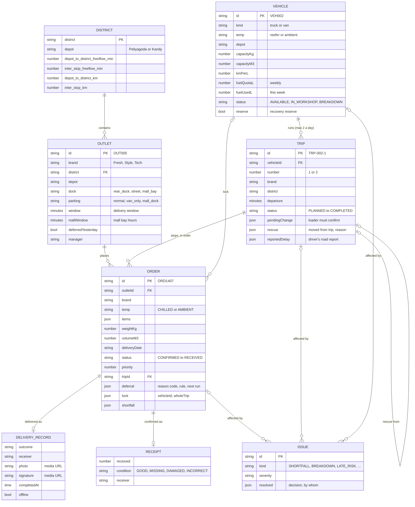
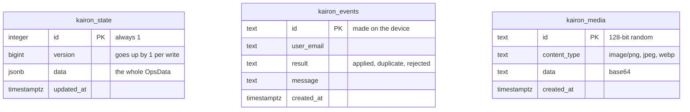
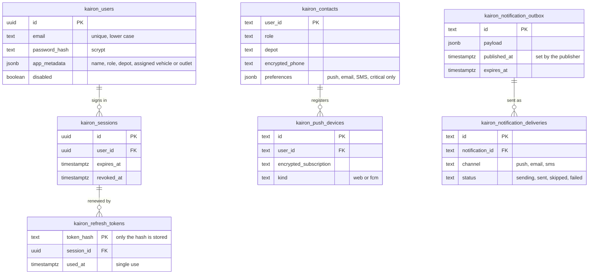

# Kairon data model

There are two layers. The **domain model** is the operation Kairon plans and runs: outlets, vehicles, orders, trips
and what happens to them. The **storage model** is how that operation is saved in PostgreSQL. The architecture is in
[architecture.md](architecture.md).

## 1. Domain model

The types are in `core/src/types.ts`. One `OpsData` object is the whole operation for the current delivery day.

These belong to the operation as a whole rather than to one order or trip:

| Field | Holds |
|---|---|
| `deliveryDate`, `clock` | The day being run, and the operation clock (in demo mode the clock can be moved) |
| `ordersClosed`, `plan` | Whether the 16:00 cutoff has passed; plan status `NONE`, `DRAFT` or `PUBLISHED` |
| `calendar`, `allowances`, `catalog` | Operating days, paydays and festivals; service minutes per brand and dock; products with their volume and weight |
| `notifications` | Messages to each role, with who has read them |
| `audit` | Every change: entity, time, role, what happened. This is the history behind **History & audit** |
| `syncLog` | One report per offline period: events received, deliveries, conflicts, whether the route changed and when the driver acknowledged it |
| `presence` | When each user and vehicle was last heard from |
| `predictions` | Datathon model outputs: service time and late risk per delivery, and demand per depot, brand and week |
| `demoSource` | Demo days only: the reference rows the day was built from, so a reset can rebuild it without the CSVs |

### Where the data comes from

| Competition CSV | Becomes | Mapping |
|---|---|---|
| `outlets.csv` | `Outlet` | Brand, district, depot, dock and parking; the delivery window narrowed to the mall window for mall outlets |
| `vehicles.csv` | `Vehicle` | Kind, temperature, capacities, fuel profile, depot |
| `fleet_status.csv` | `Vehicle.status` | `in_workshop` becomes `IN_WORKSHOP`. If the file is missing, every vehicle is available |
| `district_travel.csv` | `DISTRICT` | Free-flow minutes and km for trip time and fuel |
| `service_allowance.csv` | `allowances` | Service minutes per brand and dock type |
| `calendar.csv` | `calendar` | Operating days and the next delivery day after the cutoff |

The CSVs are validated on load (`core/src/csv.ts`) and never committed to the repository.

### Rules the model enforces

- **Whole orders.** An order is on one trip of one vehicle or it is deferred; it is never split. A Fresh outlet
  usually has two orders a day, chilled and dry, because they travel on different vehicles.
- **Trips** have one brand and one district. A vehicle runs at most 2 trips a day; Fresh trips share a 270-minute
  budget, Style and Tech a 480-minute budget.
- **Order status** normally moves forward: `CONFIRMED` → `PLANNED` → `LOADED` → `IN_TRANSIT` → `ARRIVED` → `DELIVERED`
  or `PARTIAL` → `RECEIVED`. An order can instead become `DEFERRED` (with a reason) or `FAILED`; unassigning a planned order puts it back to
  `CONFIRMED`.
- **Trip status:** `DRAFT` (before the plan is published) → `PLANNED` → `LOADING` → `LOADED` → `IN_PROGRESS` (or
  `PAUSED` after a breakdown) → `COMPLETED`, or `ABORTED`.
- Every allocation, automatic or by hand, passes `validate()` against all 12 booklet rules; there is no override.
  The planning page re-checks the whole current plan (`checkAllocations`) and shows the result.
- **Closing a day** (`startNextDay`) adds the fuel of the day's completed trips to `Vehicle.fuelUsedL`, which resets
  to 0 on a new ISO week. It also updates outlet service history, moves deferred orders to the next run, clears the
  day's trips and advances `deliveryDate`.

## 2. Storage model

The operation itself is stored the same way everywhere: three tables and one commit function, in AWS RDS
(`database/migrations/001_rds.sql`), the local PostgreSQL (`server/src/db-postgres.ts`) and Supabase
(`supabase/migrations/202610010001_kairon.sql`). On AWS, RDS also holds accounts, sessions and notifications
(section 2b).

| Table | Holds | Why it's separate |
|---|---|---|
| `kairon_state` | One row: the whole operation as JSONB, plus its version | The rules check a plan as a whole (see below) |
| `kairon_events` | One row per field event a device sent | An outbox can be sent twice after a bad connection; a known id is skipped |
| `kairon_media` | Proof-of-delivery photos and signatures | Keeps large images out of the state; the state stores a URL to them |

**`kairon_commit(expected_version, next_state, new_events, new_media)`** runs every write in one transaction:
1. It takes an advisory lock, so two API instances can't commit at the same moment.
2. It checks the stored version against the one the server read. If they differ, it raises error `40001` and the API
   answers 409.
3. It inserts the event ids and media (skipping ids it already has), then saves the new state with version + 1.

## 2b. Accounts, sessions and notifications (AWS RDS)

| Table | Holds |
|---|---|
| `kairon_users` | Accounts: email, scrypt password hash, role and assignments in `app_metadata`, disabled flag |
| `kairon_sessions`, `kairon_refresh_tokens` | Sign-in sessions with expiry and revocation; refresh tokens stored only as hashes and used once |
| `kairon_contacts`, `kairon_push_devices` | Who to notify and how: preferences, encrypted phone number, encrypted push subscriptions |
| `kairon_notification_outbox` | Notifications written in the same transaction as the change; the publisher sends them to SQS |
| `kairon_notification_deliveries` | One row per user and channel, with status and attempts |
| `kairon_security_audit`, `kairon_operational_audit` | Sign-ins, sign-outs and settings changes; operational records |
| `kairon_schema_migrations` | Which migrations have run |

On AWS, `kairon_media` keeps only an `object_key`; the photo itself is in the private S3 proof bucket.

## 3. Why one versioned snapshot, not one table per entity

**A plan is only valid as a whole.** Moving one stop changes the arrival time of every later stop on that trip. Trip
time, the two-trip limit, the Fresh time budget and the weekly fuel quota are checked across all of a vehicle's trips.
The shared core therefore validates and changes the whole operation in memory, in the browser and on the server alike,
and the server saves the result of each command as one versioned document.

**What this buys:**
- Every save is consistent: no half-applied plan is ever stored.
- Several devices or serverless instances can write safely. A stale write is refused, never merged silently.
- An offline outbox is applied exactly once, thanks to `kairon_events`.
- The browser and server run the same code on the same shape of data, with no mapping layer.

**What it costs:**
- No per-order SQL queries. Reporting has to read the document, or use the CSV export at `/api/export/allocation.csv`.
- The document grows with the day's audit trail and notifications. One regional operation of about 150 orders a day
  is a few hundred kilobytes (about 390 KB at the end of a full demo day).
- Writes are serialised, which suits one operation with four kinds of user.

**If Kairon grew** to many depots, or kept months of history for reporting, the next step would be to keep the
snapshot for the live day and archive each finished day into per-entity tables (`orders`, `trips`, `deliveries`)
for querying.
